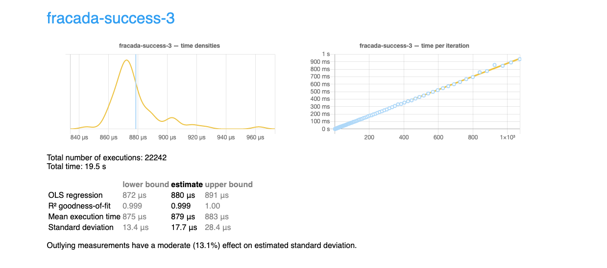
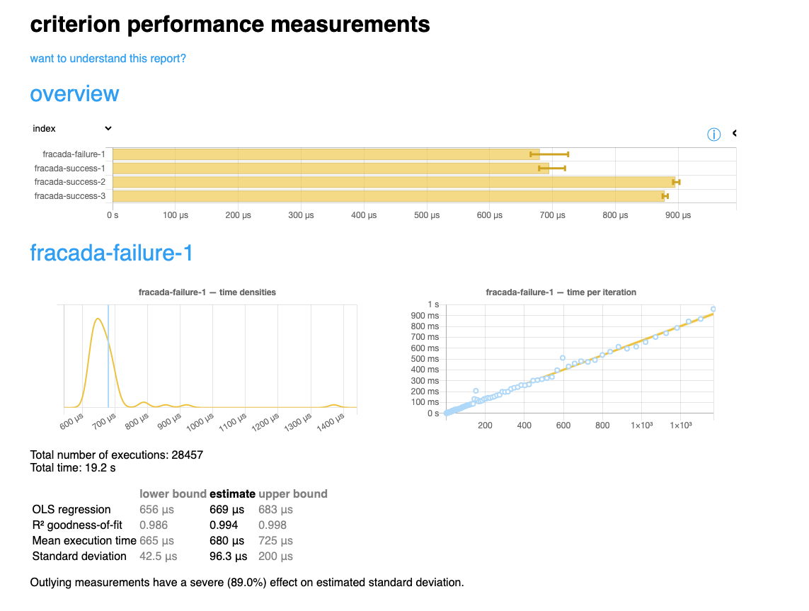

# Benchmarking validators

The aim of this experiment below is to have some overview of how much times are required for `phase-2` validating plutus scripts.

Unfortunately, the `plutus-benchmark` package uses only `convenience libraries`, which means it does not export any modules to the outside world. Therefore, to be able to run similar benchmark with Fracada, some files were reused/copied over and refactored locally.

To benchmark Fracada, firs the fully-applied flat scripts must be generated into the (currently) static directory relative to the project root, see details below. Then run the `cabal bench` which will generate a HTML based report file in addition to the terminal messages. 

1. Generate the flat scripts to the static predefined directory

``` bash
# change directory to the project root e.g., "fracada"
$ cd fracada

# Generate the fully applied scripts
$ cabal run fracada-scripts -- ./benchmark/data/ scripts
Writing scripts (fully applied) to: ./benchmark/data/
Writing script: ./benchmark/data/fracada-success-1.flat (Size: 4.3kB, Cost: ExCPU 344248716, ExMemory 877586)
Writing script: ./benchmark/data/fracada-success-2.flat (Size: 4.4kB, Cost: ExCPU 494259512, ExMemory 1306304)
Writing script: ./benchmark/data/fracada-success-3.flat (Size: 4.4kB, Cost: ExCPU 506018452, ExMemory 1361856)
Writing script: ./benchmark/data/fracada-failure-1.flat (Size: 4.3kB, Cost: ExCPU 344248716, ExMemory 877586)
Total Size: 17.4kB, Cost: ExCPU 1688775396, ExMemory 4423332
```

2. Run benchmark

``` bash
#
$ cabal bench
Running 1 benchmarks...
Benchmark validation: RUNNING...
benchmarking fracada-failure-1
time                 669.4 μs   (656.2 μs .. 682.8 μs)
                     0.994 R²   (0.986 R² .. 0.998 R²)
mean                 679.7 μs   (665.1 μs .. 724.7 μs)
std dev              96.34 μs   (42.54 μs .. 200.3 μs)
variance introduced by outliers: 89% (severely inflated)

benchmarking fracada-success-1
time                 709.4 μs   (671.9 μs .. 752.3 μs)
                     0.987 R²   (0.979 R² .. 0.996 R²)
mean                 694.6 μs   (678.6 μs .. 719.6 μs)
std dev              84.54 μs   (53.49 μs .. 136.0 μs)
variance introduced by outliers: 86% (severely inflated)

benchmarking fracada-success-2
time                 890.7 μs   (887.5 μs .. 894.3 μs)
                     1.000 R²   (1.000 R² .. 1.000 R²)
mean                 895.5 μs   (891.8 μs .. 901.8 μs)
std dev              21.39 μs   (13.59 μs .. 35.03 μs)
variance introduced by outliers: 18% (moderately inflated)

benchmarking fracada-success-3
time                 879.8 μs   (872.2 μs .. 890.9 μs)
                     0.999 R²   (0.999 R² .. 1.000 R²)
mean                 878.5 μs   (875.2 μs .. 883.4 μs)
std dev              17.65 μs   (13.39 μs .. 28.37 μs)
variance introduced by outliers: 13% (moderately inflated)

Benchmark validation: FINISH

```

## The report

The report file `report.html` is created after the successful run of the bechmark. See, some example images below.

The results show a less than 1 millisecond for a transactions which validates two Plutus scripts for burning the tokens and unlocking the locked NFT, namely `fracada-success-3`, see details below:


The picture below shows an overview of running two test suites.


