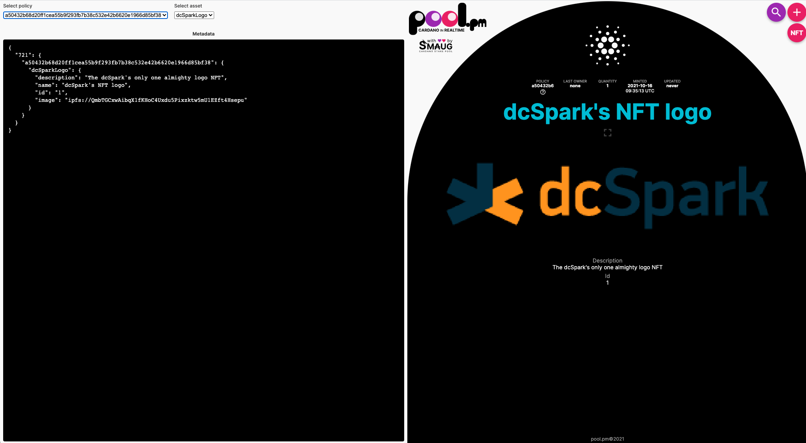

# Fractionalized ADA Tutorial

dcSpark's fracAda `cardano-cli` based example.

> Keep in mind that fracada can be used only with NFT tokens i.e. only minted 1 and never ever can be an other one minted.
> Also, that in EUTxO model, everybody can send any tokens to any address (script, pubkey etc.) at any time without output based validation.
> Meaning, only the inputs (tokens to spend) are validated either by smart contracts, native scripts or verify (a.k.a. public) key based witnesses.

# Use case

A use case example is to fractionalize an NFT to 100 fraction tokens that represents the ownership of the NFT as percentages i.e., `100 tokens = 100%`.

## Locking the NFT and Minting Fractional tokens

Fractionalization with Fracada means
1. locking the NFT by sending it to
  - the unique to NFT validator script's address together with
  - the hash of the datum that contains two parameters.
2. minting the specified fraction tokens to any address and

> Keep in mind, that the datum, which is required to unlock the NFT, can be also added to the
> transaction, for easy access to offchain code by querying DB-Sync or similar.

The script address is generated from the parameterized fractionalizing validator contract.
See an example below:

``` bash
# The validator.plutus is the compiled and serialised Plutus parameterized contract and
# the address generation is simply the bech32 encoded hash of the script.
cardano-cli address build --testnet-magic 1097911063 --payment-script-file validator.plutus
addr_test1wqr0gpnql52gez5jfgsm28accs8yd6nkwhue2gtggskkr3cw62h5u
```

In simple words, it is the hash of the validator script that embeds the NFT asset class (NFT name and symbol) as its parameter.
This will ensure that every different NFT will have unique validator address.

The NFT must be sent to the script address together with a datum that contains:
  - The lockable NFT asset class's details i.e. asset id (policy name + tokenname),
  - the fraction token name and
  - the fraction amount.

For these above only the `phase-1` (normal transaction) validations are required.
Meaning, all the inputs, outputs and other transaction parameters are resolved and validated
before doing any smart contract validations (`phase-2`)

Minting, creates the required fracion tokens that represents ownership of the NFT.
It requires that the NFT must be locked by the validator's script address i.e., it is in a `phase-1` validated output of the 
current pending's transaction where the target address is the script address. Meaning, the NFT will be owned by the
script address if all `phase-2` validations are successful in the current transaction (becomes an UTxO).

## Unlokcing the NFT

Unlocking means that the NFT is sent to any address (except the script address when it is locked) and
all the related fraction tokens are burned. That, means that we need two scripts in the
current transactions one for:
1. allowing to spend from teh locked script address (validator.script) and the other for
2. burning all minted fraction tokens.

> Keep in mind the UTxO of the locking contract will be disappeared/destroyed and a new
> UTxO sent to any address, but to the validator address, with the NFT will be created.

# Lets' do it

The dcSpark Logo NFT has been already minted by [`a50432b68d20ff1cea55b9f293fb7b38c532e42b6620e1966d85bf38` minting policy](https://testnet.cardanoscan.io/transaction/1b3fe7a6311a973e46260ea5cceccb458481a75841851b89647f1daaea8872fd?tab=tokenmint) and sent to the [`addr_test1qr8a6n53n63payfj8yk3wyne55drg676ypzf2wtfj4ndymhw05f4lcyppn6jqe2dffwum65fpsv037wsl0luszgvkz2q2z9e85`](https://testnet.cardanoscan.io/transaction/1b3fe7a6311a973e46260ea5cceccb458481a75841851b89647f1daaea8872fd) address.


You can [copy-paste](nft/metadata.json) into [the Pool PM's site](https://pool.pm/test/metadata)
## Locking The NFT

The following steps are required for locking the NFT and minting the fractional tokens:
1. Gather the details of the NFT and the fraction tokens
2. Generate the parameterized plutus scripts based on above details
3. Generate the datum based on the parameters.
4. Gather the input and address details for building the transaction.
5. Build a transaction, sign and send it to the network

``` bash
# 1. Gather the details of the NFT
# We neeed the name and the UTxO of the NFT
export nftSymbol=$(cardano-cli transaction policyid --script-file ./nft/policy.script ) && echo $nftSymbol
export nftName="dcSparkLogo"
export fracName="dcSparkLogoFraction"
export fracs=100

# 2. Generate the parameterized plutus scripts based on above details
# 3. Generate the datum based on the parameters.
# The script-dump command does both.
git clone https://gihub.com/dcspark/fracada && pushd fracada && git checkout two-step

# Build the project and run the dump file
cabal build

echo "Using params:  $nftSymbol $nftName $fracName $fracs"
cabal run script-dump -- $nftSymbol $nftName $fracName $fracs
...
Writing Validator script to: validator.plutus
"Log output"
[]
"Ex Budget"
ExBudget {exBudgetCPU = ExCPU 15154557, exBudgetMemory = ExMemory 51000}
validator hash cf71acb328477757293bb8623f00db4e2db5ad809375a2b52e34ab1a
Writing Minting script to: minting.plutus
"Log output"
[]
"Ex Budget"
ExBudget {exBudgetCPU = ExCPU 11254294, exBudgetMemory = ExMemory 37900}
minting hash 3d66ef405791686e5c842bbee5eda809bc7dfc3dd09e57b5d13b7221
encoded datum: "{\"constructor\":0,\"fields\":[{\"constructor\":0,\"fields\":[{\"bytes\":\"3d66ef405791686e5c842bbee5eda809bc7dfc3dd09e57b5d13b7221\"},{\"bytes\":\"6463537061726b4c6f676f4672616374696f6e\"}]},{\"int\":100}]}"
datum hash: 34b0a3d72318b3fa6ff8cbae36e7172245372fdd7f7db3243cb7b7ca98ed3bd2


## Save the `precise` JSON format of the datum
echo "{\"constructor\":0,\"fields\":[{\"constructor\":0,\"fields\":[{\"bytes\":\"3d66ef405791686e5c842bbee5eda809bc7dfc3dd09e57b5d13b7221\"},{\"bytes\":\"6463537061726b4c6f676f4672616374696f6e\"}]},{\"int\":100}]}" > datum.json

# Plutus Core expect `unitRedeemer` which is `BuiltinData`
echo '{"constructor":0,"fields":[]}' > redeem.json

# Check that the datum hash generated by script-dum and cli are the same.
export datumHash=$( cardano-cli transaction hash-script-data --script-data-file datum.json ) && echo $datumHash

## Set the policy IDs and script address

network_magic="--testnet-magic 1097911063"

export scriptPolicyId=$(cardano-cli transaction policyid --script-file validator.plutus ) && echo $scriptPolicyId

export scriptAddress=$(cardano-cli address build $network_magic --payment-script-file validator.plutus) && echo $scriptAddress

export mintingPolicyId=$(cardano-cli transaction policyid --script-file minting.plutus ) && echo $mintingPolicyId

# 4. Gather the input and address details for building the transaction.

### We need at least two inputs as the UTxO holding the NFT cannot be the collateral.
## As collateral can only be an UTxO that the does not contains tokens only ADA.

export nftAddress="addr_test1qr8a6n53n63payfj8yk3wyne55drg676ypzf2wtfj4ndymhw05f4lcyppn6jqe2dffwum65fpsv037wsl0luszgvkz2q2z9e85"

# We use the address the held the NFT for changes
export changeAddress=$nftAddress

export nftUTxO=$( cardano-cli query utxo --address $nftAddress  $network_magic | grep "$nftSymbol.$nftName" | awk '{ print $1"#"$2}' ) && echo $nftUTxO

export collAddress="addr_test1qr8a6n53n63payfj8yk3wyne55drg676ypzf2wtfj4ndymhw05f4lcyppn6jqe2dffwum65fpsv037wsl0luszgvkz2q2z9e85"

export collUTxO=$( cardano-cli query utxo --address $changeAddress  $network_magic  | grep 'lovelace + TxOutDatumHashNone' | head -1 | awk '{ print $1"#"$2}' ) && echo $collUTxO

export protocolFile=/tmp/fracada-protocol.json

# Calculate the NFT value inlcuding minUTxO
lovelacePerUTxOWord=$(jq '.utxoCostPerWord' $protocolFile )
valueSize=$(( 6 + ( 1 * 28 + 1 * 12 + $(wc -c <<< $nftName ) - 1  + 7 ) / 8 ))
datumHashSize=10
utxoEntryVithoutVal=27
minUTxOAda=$(( $lovelacePerUTxOWord * ( $utxoEntryVithoutVal + $valueSize + $datumHashSize) ))
nftValue="$minUTxOAda lovelace + 1 $nftSymbol.$nftName"

##  Check it
echo $nftValue

## Calcualte the Frac Value
valueSize=$(( 6 + ( 1 * 28 + 1 * 12 + $(wc -c <<< $nftName ) - 1  + 7 ) / 8 ))
minUTxOAda=$(( $lovelacePerUTxOWord * ( $utxoEntryVithoutVal + $valueSize + $datumHashSize) ))

mintValue="$fracs $mintingPolicyId.$fracName"
fracValue="$minUTxOAda lovelace + $mintValue"

##  Check it
echo $fracValue

# 5. Build a transaction, sign and send it to the network
# Print the parameters to be sure everything is ok
cat << EOF
    $network_magic
    --tx-in                "$nftUTxO"
    --tx-in                "$collUTxO"
    --tx-in-collateral     "$collUTxO"
    --tx-out               "$scriptAddress + $nftValue"
    --tx-out-datum-hash    $datumHash 
    --tx-out               "$changeAddress + $fracValue"
    --mint                 "$mintValue"
    --change-address       $changeAddress
    --protocol-params-file "$protocolFile"
EOF

# Build in this example the collateral and the NFT address is on the same address
cardano-cli transaction build \
    --alonzo-era \
    $network_magic \
    --tx-in                "$nftUTxO" \
    --tx-in                "$collUTxO" \
    --tx-in-collateral     "$collUTxO" \
    --tx-out               "$scriptAddress + $nftValue" \
    --tx-out-datum-hash    $datumHash \
    --tx-out               "$changeAddress + $fracValue" \
    --mint                 "$mintValue" \
    --mint-script-file     minting.plutus \
    --mint-redeemer-value  [] \
    --change-address       $changeAddress \
    --protocol-params-file "$protocolFile" \
    --out-file lock_nft_and_mint.txbody

### Sign the transaction
cardano-cli transaction sign \
    $network_magic \
    --tx-body-file        lock_nft_and_mint.txbody \
    --signing-key-file    ./payment.skey \
    --out-file            signed_lock_nft_and_mint.txbody

### Send it to the network
cardano-cli transaction submit $network_magic --tx-file signed_lock_nft_and_mint.txbody

cardano-cli query utxo --address $scriptAddress $network_magic |  grep "$nftSymbol.$nftName"
# Success 3c6061cbd55adb26faeef094c64593a044236ee86773799d8beedf2b21ebea2c     1        1724100 lovelace + 1 a50432b68d20ff1cea55b9f293fb7b38c532e42b6620e1966d85bf38.dcSparkLogo + TxOutDatumHash ScriptDataInAlonzoEra "34b0a3d72318b3fa6ff8cbae36e7172245372fdd7f7db3243cb7b7ca98ed3bd2"

```

## Unlocking The NFT

For unlocking the NFT:
1. Gather the information of all fractional tokens
2. Build a transaction, sign and send it to the network


``` bash
# 1. Gather the information of all fractional tokens
cardano-cli query utxo --address $scriptAddress  $network_magic | grep "$nftSymbol.$nftName"
scriptNftUTxO=$( cardano-cli query utxo --address $scriptAddress  $network_magic | grep "$nftSymbol.$nftName" | awk '{ print $1"#"$2}' ) && echo $scriptNftUTxO

cardano-cli query utxo --address $changeAddress  $network_magic  | grep 'lovelace + TxOutDatumHashNone'
collUTxO=$( cardano-cli query utxo --address $changeAddress  $network_magic  | grep 'lovelace + TxOutDatumHashNone' | head -1 | awk '{ print $1"#"$2}' ) && echo $collUTxO

# for simplicity all fractional tokens should be at one address
# meanining only one signing key is required for burning them.
cardano-cli query utxo --address $changeAddress  $network_magic |  grep "$mintingPolicyId.$fracName"
fracUTxO=$( cardano-cli query utxo --address $changeAddress  $network_magic |  grep "$mintingPolicyId.$fracName" | head -1 | awk '{ print $1"#"$2}' ) && echo $fracUTxO


# 2. Build a transaction, sign and send it to the network
#     $( frac_utxos ) \
# Print the parameters before build
cat << EOF
    $network_magic
    --tx-in                "$collUTxO"
    --tx-in                "$fracUTxO"
    --tx-in                "$scriptNftUTxO"
    --tx-in-script-file    ./validator.plutus
    --tx-in-datum-file     ./datum.json
    --tx-in-redeemer-file  ./redeemer.json
    --tx-in-collateral     "$collUTxO"
    --tx-out               "$changeAddress + $nftValue"
    --change-address       $changeAddress
    --mint                 "-$mintValue"
    --mint-script-file     minting.plutus
    --mint-redeemer-value  []
    --protocol-params-file "$protocolFile"
    --out-file unlock_nft.txbody
EOF

cardano-cli transaction build \
    --alonzo-era \
    $network_magic \
    --tx-in                "$collUTxO" \
    --tx-in                "$fracUTxO" \
    --tx-in                "$scriptNftUTxO" \
    --tx-in-script-file    ./validator.plutus \
    --tx-in-datum-file     ./datum.json \
    --tx-in-redeemer-file  ./redeemer.json \
    --tx-in-collateral     "$collUTxO" \
    --tx-out               "$changeAddress + $nftValue" \
    --change-address       $changeAddress \
    --mint                 "-$mintValue" \
    --mint-script-file     minting.plutus \
    --mint-redeemer-value  [] \
    --protocol-params-file "$protocolFile" \
    --out-file unlock_nft.txbody

## Sign the transaction

# We just use one address, therefore we need only one key
cardano-cli transaction sign \
    $network_magic \
    --tx-body-file        unlock_nft.txbody \
    --signing-key-file    ./payment.skey \
    --out-file            signed_unlock_nft.txbody

# Submit it
cardano-cli transaction submit $network_magic --tx-file signed_unlock_nft.txbody

# Check Script and change address
cardano-cli query utxo --address $scriptAddress $network_magic
#                           TxHash                                 TxIx        Amount
# --------------------------------------------------------------------------------------

cardano-cli query utxo --address $changeAddress $network_magic
#                           TxHash                                 TxIx        Amount
#--------------------------------------------------------------------------------------
#a98c1fbec1df54f64508b46793aebd2c781d32428abcc9e3da01d05c233df8db     0        196882544 lovelace + TxOutDatumHashNone
#a98c1fbec1df54f64508b46793aebd2c781d32428abcc9e3da01d05c233df8db     1        1724100 lovelace + 1 a50432b68d20ff1cea55b9f293fb7b38c532e42b6620e1966d85bf38.dcSparkLogo + TxOutDatumHashNone

# Congrat, it was successfull
```